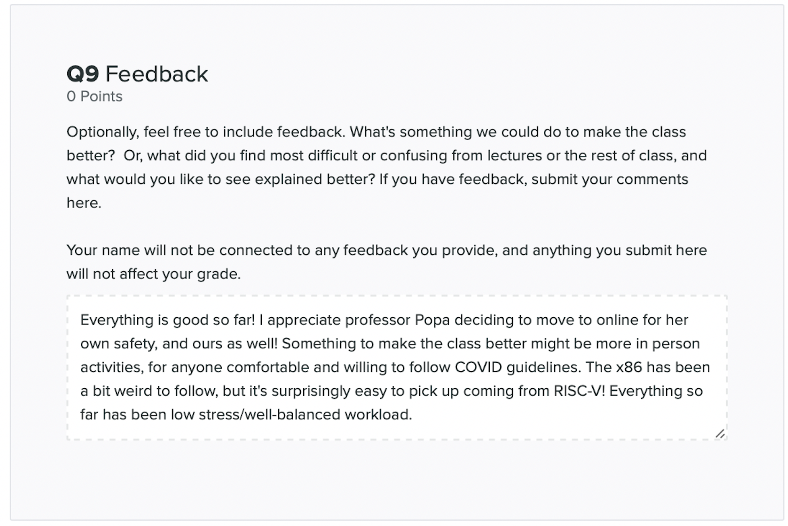
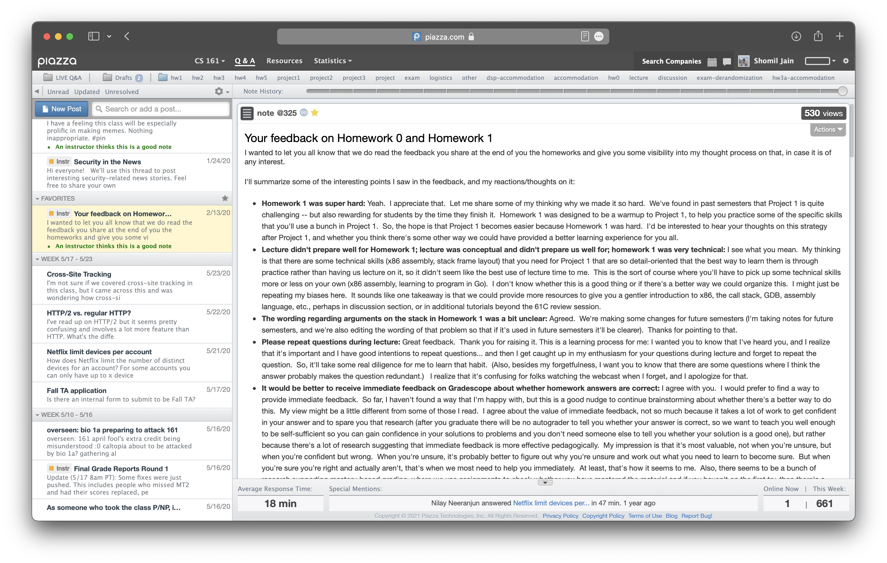
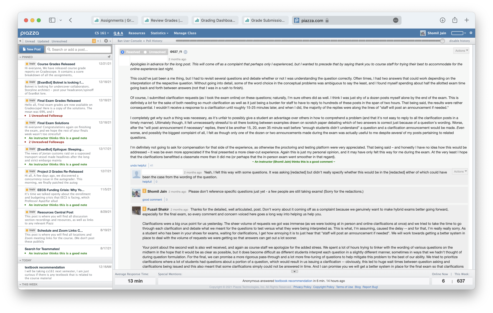
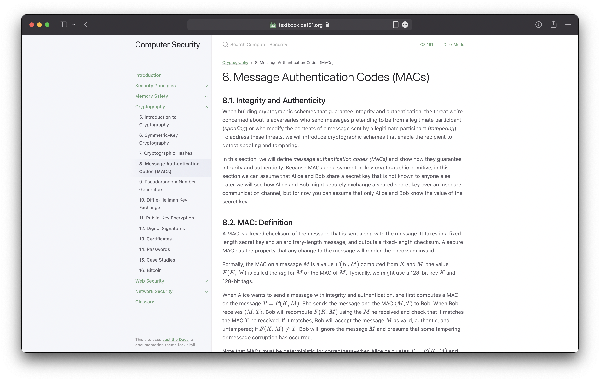
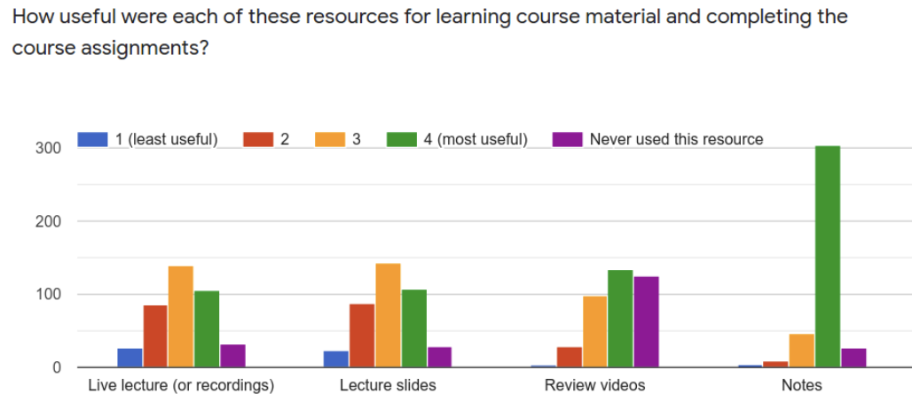
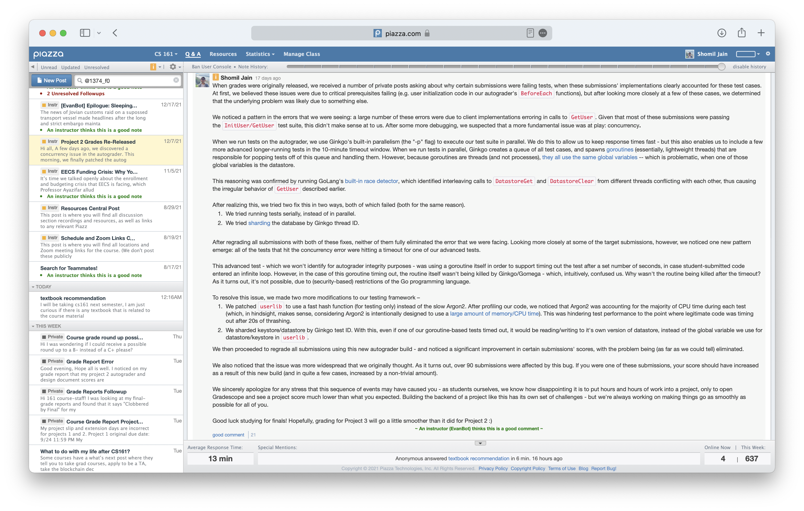
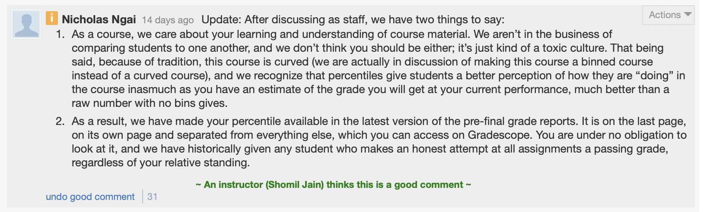
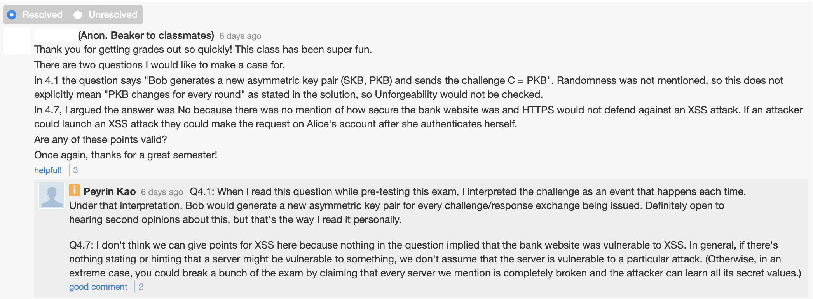
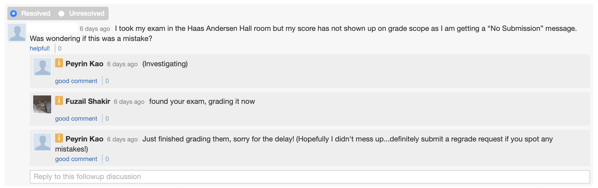
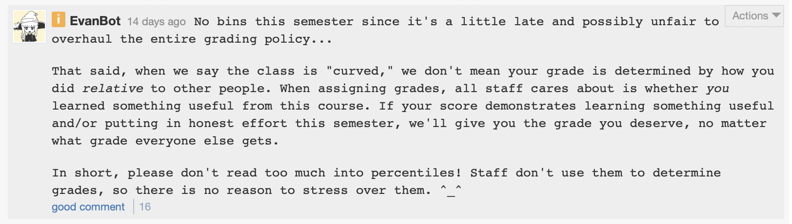

> ⚠️This post is a work-in-progress! ⚠️

> Below, I've outlined a few things I've learned over the past few semesters of TA'ing for CS 161 at UC Berkeley. These notes are a product of my perspective as both a student and as an undergraduate instructor!

**Ask for feedback, and ask for feedback often.** I'm starting with, arguably, the most important tip - even if you ignore **literally everything** else in this post, please, please do this. Many of the tips I've noted here are based off of thousands of data points collected through feedback that we've sourced directly from students.

In 161, we ask for feedback in two critical places: at the end of each homework assignment in a free-form text box, and immediately after an exam takes place. Asking for this free-form feedback allows us to interface directly with students & resolve concerns as they arise. 

Here's the question we use to ask for feedback, and an example feedback submission we received from one of our students:

> 

We have a script that scrapes this feedback from Gradescope and dumps it into a Google Doc, which we then review at our weekly staff meetings.

Some concerns raised through feedback may be significant enough to warrant a standalone "response" post. Here's one that David Wagner posted in the Spring 2020 iteration of CS 161, back when I was a student:

These feedback channels are also a critical component to making students feel heard & building a community in which people feel included, aren't afraid to ask questions, and share their frustrations through constructively (as opposed to [destructively](https://www.reddit.com/r/berkeley/comments/rbe23e/data_100_final_project_is_straight_bullshit/)). Here's an example of feedback (and response) from a **"How did the exam go?"** post.

---

**Be lenient with extensions.** Life as a student (especially at UC Berkeley) is often fatiguing, chaotic, and incredibly stressful. As instructors, many of the things we do directly contribute to a student's mental health. If we're given opportunities to reduce some of this stress (e.g. through a one or two-day extension, a few added slip days due to power outages, etc.) -- we should make it happen! When planning your course schedule at the beginning of the semester, throw in a scattering of buffer days -- and sprinkle a few random (intentional) extensions in as the semester progresses to relieve stress. [Here's an example of what not to do.](https://www.reddit.com/r/berkeley/comments/rdqh4j/drama_in_ee_120_who_do_you_side_with/?utm_source=share&utm_medium=ios_app&utm_name=iossmf)

**Be wary of what and when you're email-blasting.** Be cognizant of what times you're email-blasting information -- especially sensitive/important information. Blasting exam grades at 9:30 PM on a Friday might not be a move...perhaps wait until Saturday morning for an email blast! Also, please don't flood students' inboxes with emails; try to keep blasts to 1-2 a week.

**Send out a weekly announcements post on Sunday or Monday, with deadlines & due dates for the week.** We've received feedback that these announcement posts help students stay on track!

**Always, always, always simplify student-facing logistics.** When designing policies, procedures, and other student-facing documents, keep things simple - as simple as possible. The most critical example of this: exam logistics **should never exceed one page.** Here's an example of [what to do](https://cs161.org/exam), and [what not to do](https://docs.google.com/document/d/1TQojO7tDzQtGzuMAFiXIBwvEEmX_Z454b1yzvcrqzzc/edit).

**Kind words are important.** In 161, we ask our proctors to run down a list of announcements at the start of an exam -- and the very last announcement is always a set of kind words (e.g. "You'll all do great!"). Similarly, we try to begin and end our email blasts with a few kind words as well, rather than going straight to business. These all contribute to building a welcoming course environment!

**Deliver content through multiple forms, if possible.** Over the past few semesters, we released a course textbook to supplement and enhance lecture. We did this to support students who better understand content through text (as opposed to verbal/graphical content delivered through lecture & lecture slides). This semester, I also put together a [Networking 101](https://docs.google.com/presentation/d/1TFIg7BBLqknzRl59IPGbDlvv53JRsoOZOlw17wilFLY/edit#slide=id.p) slide deck that covers the foundations of networking in more depth than our traditional lecture slides - this was also well recieved by students!

Not everyone learns the same way -- so if you're able to provide several different methods of digesting course content, then do so.

Also, collect data on what works for students - and put TA hours toward building out the things that work! We polled students on how helpful they found the textbook in SU21 and FA21 (while we were actively developing it over that period of time), and we saw an increase of nearly 20% of students who rated the helpfulness of the textbook a 4/4.

> 
 

Aside: [CS 170](https://cs170.org) does this really, really, really well (lecture, reading, section/section walkthrough, mini-lecture/conceptual walkthroughs, assignments/assignment walkthroughs). 

**People generally like video walkthroughs of things.** Our video walkthrough for [Project 1](https://www.youtube.com/watch?v=psxuAU9PycE) (1300 views) and [Project 2](https://www.youtube.com/watch?v=HVw4z_RVH20) (900 views) were among our most-viewed videos for the entire semester. We have a hunch that these were particularly helpful to students who were conceptually behind and/or felt lost -- considering we had only 600 enrolled students, it seems many students referenced these videos several times.

**Be transparent!** Earlier this semester, we released a buggy autograder, with some students recieving lower-than-intended scores. When we re-released grades a few days later, we posted this note along with our update, which was well-received by students!

**Make the exam-taking experience as smooth as possible.** Here are a few easy-to-catch things that we look for in our exams to make the experience better for our students:

- If you're offering hybrid exams, pay close attention to equity across formats (e.g. limit short-answer questions to one sentence, so you're not giving fast typers a significant advantage).
- When pre-testing, *print out the exam*. Sometimes, how pages line up influence the exam taking process (e.g. question on the front of a page, with the answer box on the back).
- Make sure your exam's accessible to students who don't speak English as their first language! Try to stay away from using large words & big blocks of text. Keep sentences short & concise.

**Exams shouldn't leave students feeling depressed!** To do so, follow Dan Garcia's [tips on writing good exam questions](https://eecs.berkeley.edu/resources/gsis/current/prep). A few major recommendations –

- Strive to make questions have a balance of A-level, B-level, and C-level questions.
- Every students should get some credit on each problem.
- Most problems should have a "fun" part that makes students think!
- Try very, very hard to keep exam means around 50-70%. Even if all students do poorly, opening Gradescope to see a 35/100 is something that **does** impact a student's mental health.

**Instead of flat-out rejecting student demands, compromise wherever possible!** Here's an example: we release grade reports three times throughout the semester - after the midterm, before the final, and after the final. In our first round of grade reports, we received feedback (through our HW feedback channel) that percentiles were causing a stressful, competitive environment, where people were forced to compare themselves to their peers when looking at their grade reports. As such, we took these percentiles out in the second round. This immediately received pushback on Piazza -- to which, we re-discussed and released this:

> 

**Allow students to discuss/ask questions about exam rubrics on Piazza, instead of taking a stance of "course staff knows best".** Here's the message we post on Piazza: *As always, it's certainly possible that we may have made mistakes in grading. Please submit a regrade request if you spot an issue with how we applied the rubric to your submission, and feel free to leave questions (and any other exam-related feedback) in the follow-ups to this thread.*

**When discussing regrades, tone matters - a lot.** Use neutral/positive phrases like "definitely open to hearing second opinions about this", or "I don't think we can give points for [X] here", instead of negative/combative phrases. Regrade requests shouldn't be an "us-vs-them" battle to the death; listen to students, try to hear their perspective, and share your own perspective until you're able to reach a satisfactory conclusion.

> 

**Give people updates on what's happening on Piazza, instead of leaving posts unresolved.** Our average response time on Piazza is 8-12 minutes. Admittedly, this is probably due to some degree of (voluntary) TA overwork, but it's one of the things that our course staff recieves the most amount of positive feedback for. OIne tip that I'd personally love to see in other classes: if you're blocked on immediately resolving a post or don't know what the answer is, then respond with a quick "Investigating" or "I've pinged XYZ to look into this" so students don't think you're flat-out ignoring posts! 

> 

**And finally: add a course bot!!!** A few of our TA's have been developing EvanBot (along with a pretty integrated course storyline) over the course of the past few semesters. Here are a few of Bot's capabilities: [making sensitive remarks about grading](attachments/bot-1.png), [responding to logistics requests in humorous ways](attachments/bot-2.png), and [sliding in a stray comment or two.](attachments/bot-3.png)

> 

> Much of this teaching philosophy has been adopted from conversations with some of CS 161's veteran TAs - Peyrin Kao, Nicholas Ngai, Vron Vance, Fuzail Shakir, and others - as well as from the professors who've taught CS 161 over the past few semesters: Nicholas Weaver, David Wagner, and Raluca Ada Popa.
