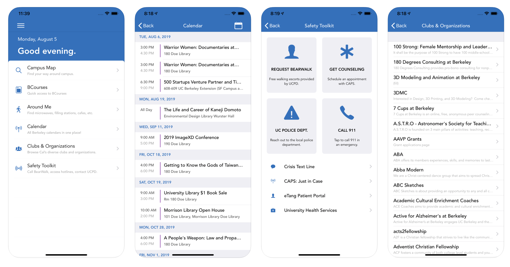

This week, a team of my peers and I launched Bear Central for [iOS](https://apps.apple.com/us/app/bear-central/id1441903611) and [Android](https://play.google.com/store/apps/details?id=org.mobiledevsberkeley.theberkeleyappandroid&hl=en_US). 

---

**App Description**

Bear Central brings together the most essential campus resources, all in one place, for a seamless mobile experience.

Features include:

- Student Organizations
- Around Me – locate filling stations, restrooms, etc.
- Interactive Campus Map
- Dining Hall Menu
- Safety Toolkit
- Campuswide Calendar

