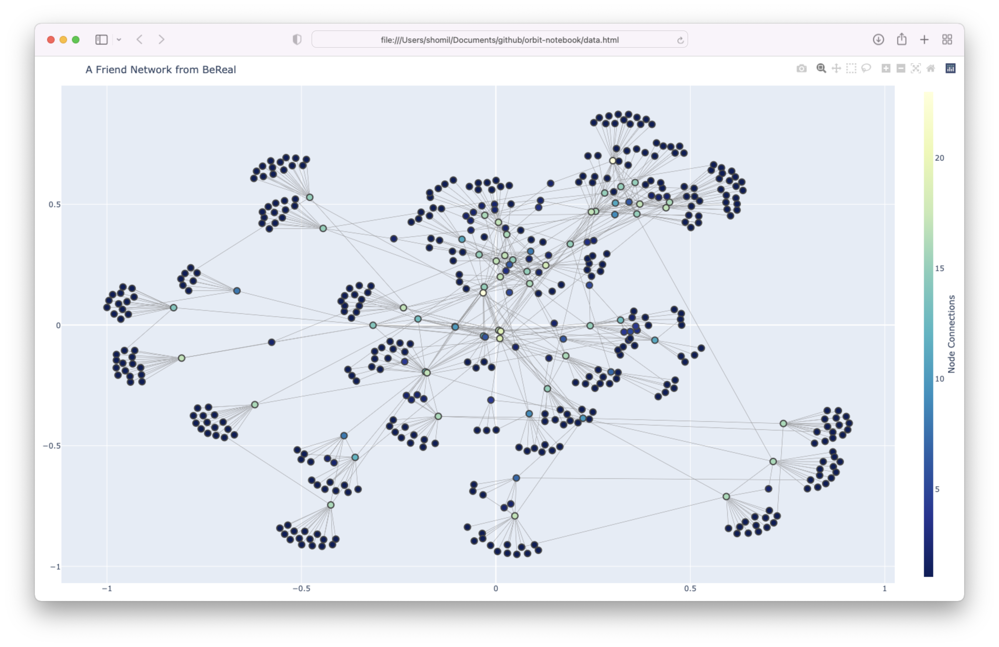

Earlier this month, I was walking back from class with one of my friends when she recieved a notification on her phone: "Time to BeReal!" She quickly opened up the app that sent it, and subsequently took a front-facing photo of where we were and motioned to me to be part of a selfie of the two of us. Two seconds later, she clicked "post."

I asked her what I had just taken part of, and she described to me how this new, viral social media app, [BeReal](https://bere.al/en), worked. Here's an introduction to the app from [Bloomberg](https://www.bloomberg.com/news/articles/2022-03-29/bereal-the-un-instagram-is-trending-at-college-campuses-by-keeping-it-casual?sref=CrGXSfHu):

> At a varying time each day, BeReal users receive a single notification en masse prompting them to take two photos — simultaneous images, shot through the front- and back-facing lens on their phone cameras. Everyone is given two minutes to take the photographs, which are then shared with their followers on the app. People who miss the daily notification can post late, but such images are conspicuously marked for being tardy. To see everyone else’s contributions, a user must first upload their own daily shots.
>
> There are no filters or “likes.” The underlying idea is that by giving users a short deadline, there’s little time for anyone to snap the perfect image. People can pose or quickly fix their hair, but more often than not users are compelled to share whatever is going on in their lives at that given moment, no matter how prosaic or unglamorous. On the app store, BeReal greets new users with a concise motto of sorts: “BeReal is life, Real life, and this life is without filters.”

I'm naturally suspicious of social media apps - so I told my friend this on the spot, and she responded with something along the lines of: "What do I have to lose? I'm already on Snapchat and Instagram and Facebook -- why not be a part of this other platform too?"

And so I started to do some research. Here are some things that I found –

- The app (and company behind it) seemed to be in its early stages. The features were barebones (but functional), and the [website](https://bere.al/en) was minimal.
- It closed a $30M (!!) funding round [backed by Andreessen Horowitz (a16z) and Accel](https://nordic9.com/news/bereal-closed-a-30-million-capital-funding-round-backed-by-a16z-dst-accel-and-kima-ventures/) in June 2021. Back then, it had ~300K MAU, mostly in France.
- The earliest mention of it in "the real world" I could find in my two minutes of scavenging was a reference to it in the Georgetown University's student newspaper in November 2021 - interestingly enough, it was an [anti-BeReal opinion article](https://thehoya.com/viewpoint-beware-of-bereal/), which I found that I agreed with quite strongly.  
- It seemed to be going viral at Berkeley solely through word-of-mouth. I didn't see or hear much about cross-posting (e.g. how Tiktok videos were quite often, and still are, cross-posted onto Instagram.)

So, naturally, I wanted to do a little bit of reverse engineering to see what exactly this $30M had backed! And so the rest of this article contains a walkthrough of my steps, thoughts, and takeaways from poking around BeReal using just an HTTP Request interceptor and a little bit of Python. Trivial reverse engineering, but quite revealing regardless.

I've translated all client-side requests into the Python Requests language for readability and mutability. I've trimmed out some of the standard headers as well. I've also fuzzed the request/response data PII - e.g. phone numbers, names, UUID's, etc. - to make sure none of them map to actual user data.

And one final disclaimer: **[1] I'm not a formal security engineer, so my poking around is from a software/architecture perspective, and [2] this is more of a privacy analysis than a security analysis.** Some of these things may be *secure* by the application's assumed threat model, but they may feel like a violation of the privacy that we expect from applications like these. I did not, at any point, "hack" BeReal, and do not intend to do so at any point in the future. My goal is purely pedalogical - to simply call out different privacy-oriented components of the design of a real-world application!

# The /scanContacts Endpoint

BeReal offers the ability to scan your contacts. When asking for this permission, the app claims that your contacts are not uploaded + stored on their servers. That said, here's an interesting request the app makes on the "Add Friends" page.

```python
import requests

headers = {
    'Host': 'us-central1-alexisbarreyat-bereal.cloudfunctions.net',
    'Firebase-Instance-Id-Token': '...',
    'User-Agent': 'AlexisBarreyat.BeReal/0.20.0 iPhone/15.4 hw/iPhone12_3',
    'Authorization': 'Bearer ...',
}

json_data = {
    'data': {
        'phoneNumbers': [
            '+14087115196',
            '+91540222551',
            '+16103672510',
            '+12253535340',
            '+13588695809',
            ...
        ],
    },
}

response = requests.post('https://us-central1-alexisbarreyat-bereal.cloudfunctions.net/scanContacts', headers=headers, json=json_data, verify=False)
```

...and here's what the response looks like:

```json
{"result": [{"name": "Albert Ghar",
             "phoneNumber": "+14087115196",
             "photoURL": "Photos/L9Mk98Ftr3bskYPFEttXje9wPlH2/profile/L9Mm98Ftg3bskYPFEttXje9wPlH2-1646543857-profile-picture.jpg",
             "uid": "L9Mm98Ftr3bgkYPFEttXje9wPlH2",
             "userName": "albertghar"},
            {"name": "Steve Smith",
             "phoneNumber": "+16103672510",
             "photoURL": "Photos/VLECGzDHUhThPmnv0LubFHDGEKR2/profile/VLVCGzDHUhThPmnv0LubFHDGEKR2-1643954998-profile-picture.jpg",
             "uid": "VLVCGzDHUhAhPmnv0LubFHDGEKR2",
             "userName": "stevesmith"}
}
```

#### Discussion

I'm a little wary of this architecture. My contacts list has ~250 contacts, and the client made a request with ~250 raw phone numbers and, in a fraction of a second, spit out full name to phone number mappings for everyone who was on the platform, along with profile picture URL's and user identifiers. It seems like this could be open to abuse: could one just pass in an arbitrary-length list of phone numbers (perhaps brute-forced), and, as long as the length of the list didn't overflow the memory of whatever server is handling this endpoint, derive a list of all of the phone number <> username (and full name) mappings on this platform? That's inherently bad architecture.

I also don't like the fact that the app claims that contacts are not stored on the server. If a request is being made with a bunch of phone numbers, that request is *probably* getting logged somewhere, along with the authentication token of the user that made the request. Using this information, a BeReal engineer could presumably put together a dataset of users' address books relatively easily.

The core engineering problem being tackled here has a name: "contact discovery." It's pretty common among social media apps. Different apps handle this differently - e.g. Snapchat and Facebook upload and store entire address books to their servers, so this is certainly one step better than that. But it's far from what I'd consider "good" design.

The folks at Signal have an excellent blog post describing their approach to [privacy preserving contact discovery](https://signal.org/blog/private-contact-discovery/) - which is a method to allow Signal clients to efficiently and scalably determine whether the contacts in their address book are Signal users **without revealing the contacts in their address book to the Signal service**.

I don't think BeReal needs to match Signal's privacy standards - I think that's an unreasonable demand. A "privacy preserving social media network" is a bit of an oxymoron - by signing up for this platform, you're inherently volunteering *some* of your data away. But there certainly must be smaller, more incremental improvements (e.g. better rate limiting, more granular opt-in/opt-out around contact disccovery) that could be made to limit abuse here.

# The /api/feeds/discovery Endpoint

Here's another interesting endpoint. The homepage of this app has a **Discovery** tab, which allows you to discover the daily BeReal posts of users who choose to make their posts public. The endpoint used to query this information is the `/api/feeds/discovery` endpoint:

```python
import requests

headers = {
    'Host': 'mobile.bereal.com',
    'User-Agent': 'BeReal/5063 CFNetwork/1331.0.7 Darwin/21.4.0',
    'Authorization': '...',
}

params = {
    'limit': '20',
}

response = requests.get('https://mobile.bereal.com/api/feeds/discovery', headers=headers, params=params, verify=False)
```

...and here's the response:

```json
{"lastIndex": "1648747266091-0",
 "posts": [{"bucket": "storage.bere.al",
            "creationDate": {"_nanoseconds": 846000000, "_seconds": 1648747267},
            "id": "NtLZ9OgIS0b2jdvy42Ob",
            "imageHeight": 2000,
            "imageWidth": 1500,
            "isPublic": True,
            "lateInSeconds": 1903,
            "location": {"_latitude": 44.913278, "_longitude": -0.644326},
            "mediaType": "late",
            "notificationID": "7k67KQCTgKD1Jiq_y6MDa",
            "ownerID": "AbfqcmwUmAWiM1j4vI7NONAwCHs2",
            "photoURL": "https://storage.bere.al/Photos/AbfqcmwUmAWiM1j4vI7NONAwCHs2/bereal/17750a05-d675-41fe-a505-5378dfdb34fb-1648747262.jpg",
            "realMojis": [{"date": {"_nanoseconds": 244000000,
                                    "_seconds": 1648747279},
                           "emoji": "😐",
                           "type": "neutral",
                           "uid": "gMRPfgbganNKJu12RGOK1SKwCiD3",
                           "uri": "https://storage.bere.al/Photos/gMRPfgbganNKJu12RGOK1SKwCiD3/realmoji/b85c9a9e-20c7-478c-8f94-7a874197aa58-vYU2ZFY3uiSDXCQB-neutral-1642222484.jpg",
                           "userName": "smallp"}],
            "region": "us-central",
            "secondaryImageHeight": 2000,
            "secondaryImageWidth": 1500,
            "secondaryPhotoURL": "https://storage.bere.al/Photos/AbfqcmwUmAWiM1j4vI7NONAwCHs2/bereal/17750a05-d675-41fe-a505-5378dfdb34fb-1648747262-secondary.jpg",
            "takenAt": {"_nanoseconds": 0, "_seconds": 1648747262},
            "updatedAt": 1648747279304,
            "userName": "gabipet"},
...}
```

#### Discussion

Let's break this down. In the response, the app serves a random list of ~20 BeReal posts (e.g. from 20 users who've chosen to make their posts public). The metadata for each of these posts contain –

- The post creation timestamp (and image capture timestamp), to high precision (nanoseconds)
- The owner ID, which can be mapped into a full name using the `/getUserNames` endpoint
- A list of `realMojis`, which contain reactions to the post made by the user's friends (and the friend UID's, along with the nanoseconds at which those reactions occurred)
- The photo URL as a direct storage bucket URL
- **The latitude and longitude at which the post was taken**, with [precision to one meter](https://stackoverflow.com/questions/1947481/how-many-significant-digits-should-i-store-in-my-database-for-a-gps-coordinate).

Another interesting thing: if I replicate this query in Python, and re-run the cell containing the request over and over again, I get a new, random set of user posts each time. 

So I wrote a little bit of code to hit this API over and over again. Nothing excessive: just 10 times, to simulate swiping down and refreshing the page 10 times (which is totally, in my opinion, within reason). 

```python
dataset = []
for i in range(10):
    for post in query_discovery().get('posts'):
        if 'location' in post:
            dataset.append([post.get('userName'), post.get('location')])
print(dataset)
```

...and here's a sample of the dataset I collected in ~5 seconds. Again, I've randomly modified the usernames here (and locations) to protect user privacy. **It took just 5 seconds to collect the precise latitude, longitude, and timestamp of ~150 BeReal users' posts.**

```
[['kaydne', {'_latitude': 40.017117, '_longitude': -105.28362}],
 ['cf14vc', {'_latitude': 43.70298, '_longitude': -72.290956}],
 ['raffh3', {'_latitude': 39.958509, '_longitude': -75.189487}],
 ['fatafa', {'_latitude': 43.138835, '_longitude': -80.266258}],
 ['maaiee', {'_latitude': 43.300878, '_longitude': -2.015236}],
 ['mefef5', {'_latitude': 48.106997, '_longitude': -1.689937}],
 ['ercten', {'_latitude': 48.147432, '_longitude': -0.391368}],
 ['cdan57', {'_latitude': 41.157043, '_longitude': -73.240702}],
 ['anaiff', {'_latitude': -32.371675, '_longitude': -54.164698}],
 ['holnss', {'_latitude': 50.772838, '_longitude': 0.264811}],
 ['nafhan', {'_latitude': 35.104979, '_longitude': -92.333383}],
 ['jaghss', {'_latitude': 42.733908, '_longitude': -84.483092}],
 ['loatli', {'_latitude': -34.434153, '_longitude': -58.594687}]
 ...]
```

Now one might argue that it's OK that all of this data is public, since these users opted into making it public. So from a security perspective, this isn't really all that interesting. But from a privacy perspective, providing this level of location/timestamp precision through an open API is worrying: this is sensitive user data! Why is it possible to extract so much user data with such ease? What if these locations map to people's homes? Workplaces?

To take this one step further, while I didn't include the post photos themselves in my toy dataset above, I'd imagine one could glean some information from the photos themselves. Each post contains a direct `photoURL` (back camera) and `secondaryPhotoURL` (front camera/selfie) -- so it'd potentially be possible to extract even more information from the content contained within these photos (e.g. gender, ethnicity, socioeconomic status, etc.). 

So considering that there's hundreds of thousands (millions?) of BeReal users with public profiles, there's an incredible amount of "scrapable" data here. That's honestly kind of terrifying. It doesn't really make sense as to why this much metadata is made available through this endpoint.

*I also tried bumping up the `limit` parameter to ~40 instead of 20, and the response only returned 20. That's good on BeReal's part. Enforcing the limit per query on the backend is important.* 

# The /friendSuggestions Endpoint

Ok, so this is the scariest section of all. Be warned.

This app contains an **"Add friends"** page. On this page, the client makes a request to the `/friendSuggestions` endpoint that looks like the following: 

```python
import requests

headers = {
    'Host': 'us-central1-alexisbarreyat-bereal.cloudfunctions.net',
    'Firebase-Instance-Id-Token': '......',
    'User-Agent': 'AlexisBarreyat.BeReal/0.20.0 iPhone/15.4 hw/iPhone12_3',
    'Authorization': 'Bearer .....',
}

json_data = {
    'data': {
        'friends': [
            'OaomHuKxYYMJimflUNbkm1rPXsy1',
        ],
        'toExclude': [],
    },
}

response = requests.post('https://us-central1-alexisbarreyat-bereal.cloudfunctions.net/friendSuggestion', headers=headers, json=json_data, verify=False)
```

...and the response looks like the following:

```json
{"result": [{"uid": "6xqLArEVbkM6WEwPpltM2k8ddJx2",
   "userName": "stevesmith",
   "countCommon": 1,
   "commonFriends": [{"uid": "OaomHuKxYEMJimflUNbkm1rPXsy1",
     "userName": "shomiljain"}],
   "name": "steve smith",
   "photoURL": "Photos/6xqLArQVbkMEWEwPpltM2k8ddJE2/profile/6xqLArQVbkM6WEwPpltM2k8ddJx2-1647191E36-profile-picture.jpg"},
  {"uid": "tD3qMoEfFHdMJVJqHIhT8moaMBl1",
   "userName": "ironman",
   "countCommon": 1,
   "commonFriends": [{"uid": "OaomHuKxYYMJGvflUNbkm1rPXsy1",
     "userName": "shomiljain"}],
   "name": "Tony Stark",
   "photoURL": "Photos/tD3qMoXfFPdMJVJqHIhT8moEMBl1/profile/tD3qMoXfFPdMJVJqHIhT8moaMBl1-16486F2975-profile-picture.jpg"}
 ...
}
```

#### Discussion

Intuivitely, how would a `friendSuggestions` endpoint work? Well, given a list of your friends, it would tell you who your friends are friends with, sorted by the number of mutual friends you have with each of your friends' friends. (That's a bit of a toungue twister.)

But here's where things get interesting: if we only pass one friend into the `friends` parameter of this request, then this basically reduces to just **finding all of the friends of the given friend that we pass in**. (I confirmed this behavior by running this endpoint on a few of my friends - with permission, of course - and asking them to confirm the endpoint's output was correct.)

So what are the implications of this? Consider these ~10 lines of code I wrote.

```python
from collections import defaultdict

tree = defaultdict(set)
visited = set()

fringe = [('2czmn8Ce1jA6ZHt0GUHWS25iWug1', 'joshhug')]

while fringe:
    neighbor = fringe.pop(0)
    print('exploring neighbor:', neighbor[1])
    for friend in get_friend_suggestions([neighbor[0]]).get('result'):
        friend = (friend.get('uid'), friend.get('userName'))
        tree[neighbor].add(friend)
        if friend not in visited:
            fringe.append(friend)
            visited.add(friend)
```

If you've taken an introductory CS class, these lines of code should look familiar - this is BFS! We start by exploring a single user (`joshug`, here, who's a hypothetical user) - and we work our way outwards in a breadth-first manner. Using this, we can pretty much..leak the entire BeReal network, assuming we run this code for long enough.

As a proof of concept, I ran this code for ~1 minute, starting at my friend's user ID (who goes to UC Berkeley). Here's what the results look like –



On this graph, each node is a user. Each edge is a "friend" relationship between two users.

Now if each user had ~500-1000 friends (e.g. on a platform like Facebook), the results of this endpoint wouldn't be all that exciting. There'd be a lot of noise; you'd be able to create some sort of social web, but it would be incredibly dense.

But on BeReal, the app, by nature, is meant for just you and your **close friends**. So inherently, you're telling BeReal (and now, let's say, *everyone*) who your closest friends are. This is really important: it's a bias built into the platform itself that amplifies the effect of this discovery.

**Which means that it's possible to discover the closest friends of pretty much every single user on this platform, including those that think they're protecting their privacy by choosing to keep their posts private.**

If I wanted to get super Black-Mirror-Esque, I could replace the little blue dots on these pictures with these user's profile pictures and full names. And for those who opted into attaching their location to their posts (which, as I noted above, seems to be a non-trivial number of users), I could throw in a location dimension as well.

---

# Takeaways

For people who're going to be building systems that are used by many people at scale –

Designing privacy-preserving software is hard. There's a lot of focus on very specific parts of software security: preventing unauthorized users from accessing application data, or defending against code injection/cross-site scripting/path traverrsal attacks/memory safety attacks (where appropriate, of course). But sometimes the most obvious attacks aren't related to these at all: they're nuances in your software architecture that have significant privacy implications, even though your application may still be "secure" by technical standards.

And more generally –

It's one thing if you're giving your data to a company whose products and services you pay for (e.g. Apple). It's another if you're voluntarily trading your data in exchange for a free service (e.g. Facebook). But it's an entirely different thing if you're unknowingly making your data available to anyone who's passed CS 61B @ UC Berkeley.

