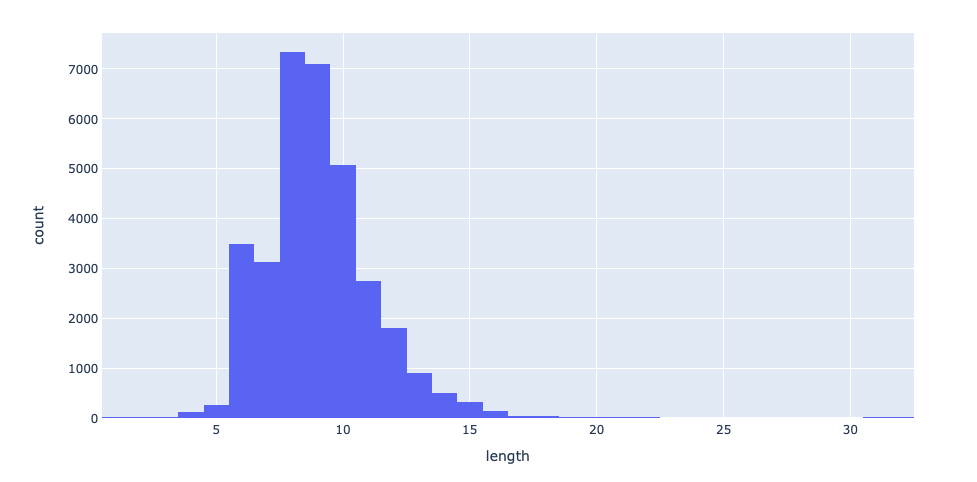
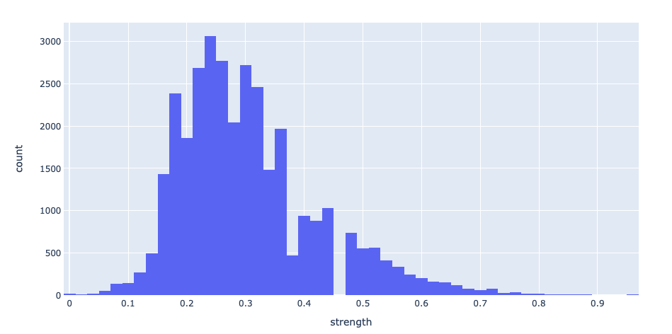

In Fall 2018, [TechCrunch](https://techcrunch.com/2018/09/26/chegg-resets-40-million-user-passwords-after-data-breach/) reported that Chegg confirmed a data breach affecting nearly 40 million customers, where hackers gained access to an internal database containing user emails and passwords. Earlier this year, a link was posted to numerous Berkeley-related websites (Reddit, Facebook Pages) containing a file of 35,000 UC Berkeley emails and passwords, reportedly sourced from the Chegg breach. In an effort to analyze the habits of UC Berkeley students through the lens of password security, I downloaded & stripped the database of usernames, leaving behind 35,000 anonymized passwords created by Cal students.

View this project on [GitHub](https://github.com/shomilj/chegg-password-analysis).

### How This Happened

When storing passwords, apps and websites typically use a [cryptographic hash function](https://en.wikipedia.org/wiki/Cryptographic_hash_function) (ex: SHA-512) to store a hashed version of the password, rather than the password itself. As a result, if any developer or third party were able to access a database of these passwords, they wouldn't be able to decipher the hash due to the one-way property of cryptographic hashes.

However, this basic implementation is vulnerable to a [dictionary attack](https://en.wikipedia.org/wiki/Dictionary_attack), where an attacker pre-computes a list of common passwords – and then uses that list to identify matches from a list of hashed passwords.

For example, the password `gobears` hashes to `c6685d07f089a532755ccfe3b35f6d42`  using the MD5 hash. From this point on, if an attacker came upon a hash of `c6685d07f089a532755ccfe3b35f6d42`, they'd know that the original, plaintext password was `gobears`. Given a large table of these pre-computed password-hash pairs for common passwords, it would be trivial to perform constant-time lookups from any password database storing passwords using this basic implementation.

To avoid this, companies usually generate a large random string (typically referred to as a `salt`) and append it to the plaintext password before generating the hash. Assuming the salt is randomly generated, this implementation prevents dictionary attacks from occurring, as the salt adds a component of randomness to each password hash, effectively making each hash unique. 

```python
# Basic Implementation
(hash(password))

# Secure Against Dictionary Attacks
(salt, hash(password + salt))
```

In the case of Chegg, given the scale of the password leak, it's a reasonable assumption that the company chose the basic implementation over the secure implementation – and an attacker was able to use a dictionary attack on a leaked database of accounts to recover plaintext passwords.


### Statistics

| Statistic                                                    | Value |
| ------------------------------------------------------------ | ----- |
| Total # Passwords Leaked                                     | 34820 |
| Average Password Length                                      | 8.944 |
| Average Password Strength ([Source](https://pypi.org/project/password-strength/)) | 0.301 |
| % Passwords with One or More Number                          | 78%   |
| % Passwords with One or More Special Character               | 13%   |
| Number of Passwords containing 'password'                    | 127   |
| Number of Passwords containing 'bears'                       | 186   |
| Number of Passwords containing 'berkeley'                    | 181   |

##### Most Common Passwords

| Password   | Count |
| ---------- | ----- |
| password   | 60    |
| 123456     | 38    |
| courserank | 36    |
| berkeley   | 32    |
| gobears    | 24    |
| evite      | 23    |
| zinch      | 17    |
| soccer     | 15    |

### Histograms

**Password Length**



**Password Strength**




### Identifying Common Structures

A common password structure involves appending the name of the website to a password base that's shared across a number of websites. For example, a user with a base password of `albert17!!pw` may use `albert17!!pwCG` for Chegg and `albert17!!pwGM` for Gmail. Identifying passwords that follow these structures could be useful for identifying access points across a number of different websites users may have accounts for.

| Statistic (not case sensitive) | Value |
| ------------------------------ | ----- |
| Passwords containing "chegg"   | 121   |
| Passwords containing "cg"      | 28    |

