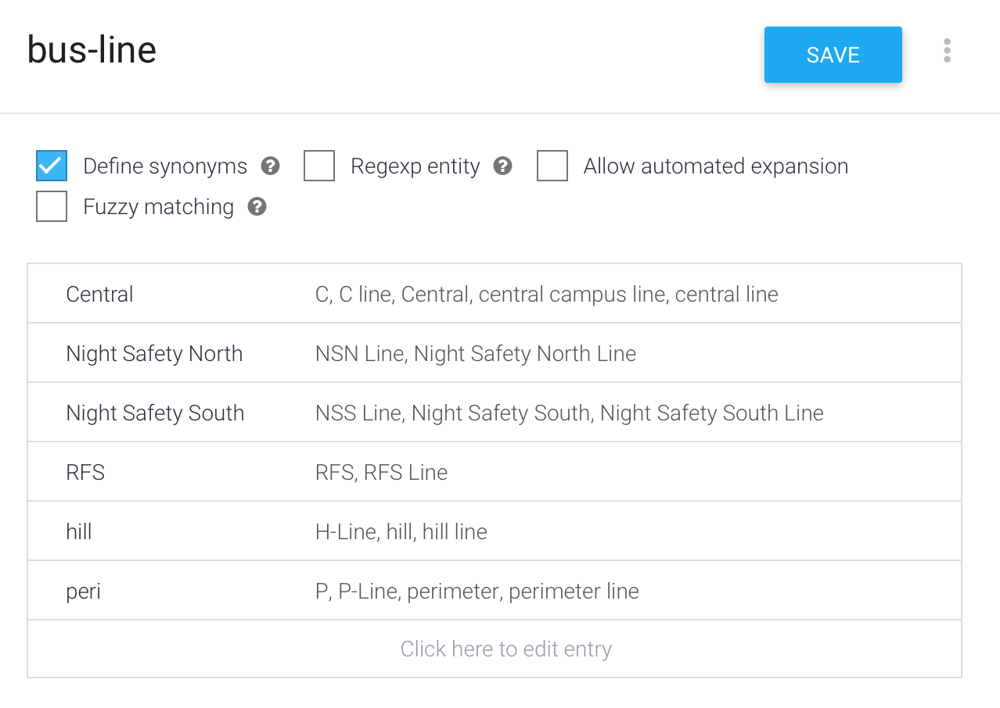
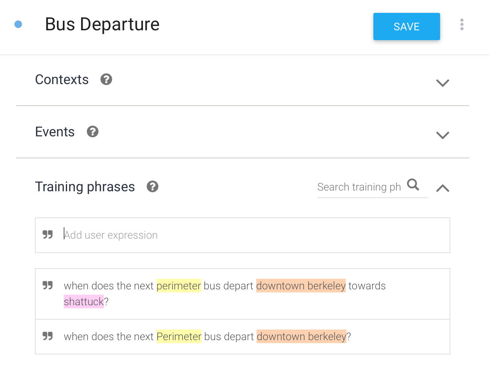
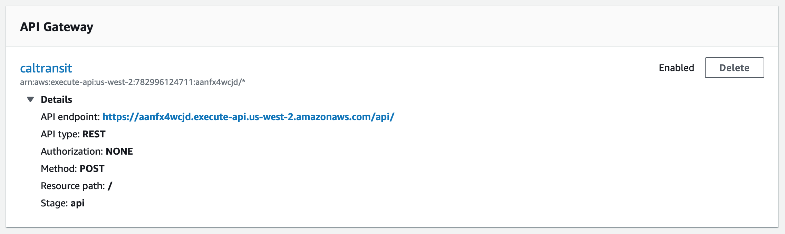

**Google's Dialogflow** is an incredibly easy platform to explore natural language processing and voice/text-based assistants at a high level. To explore what the platform could do, I created a basic agent focused on answering queries related to  UC Berkeley's intra-campus bus system – Bear Transit. 

To configure the agent, I defined two **entities** - `bus-line` and `station`. Here's what that process looks like in the Dialogflow console.

Then, I created several **training phrases** for the **Bus Departure** agent. Dialogflow automatically recognized the entities from my phrases based on the hard-coded entities defined above. 

To fulfill these requests, Dialogflow requires a Webhook that takes in a JSON payload and returns a response string to speak to the user. I built my fulfillment engine on AWS Lambda via a lightweight Python Script that made a request to Bear Transit's official API. 

Check out the code [here](https://github.com/shomilj/beartransit-dialogflow).