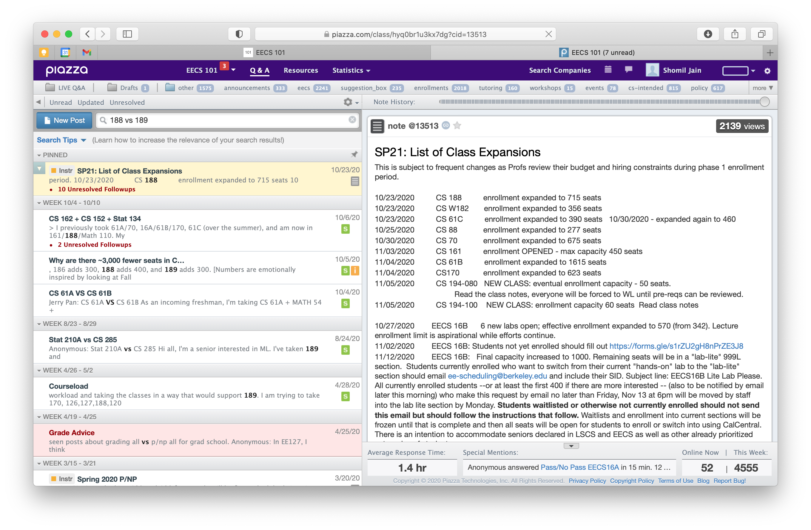

As course advising at UC Berkeley has shifted to a predominantly online format, the popularity of the EECS 101 Piazza for course & advising-related inquiries has increased rapidly. Over 4,000 students actively browse the forum, in search of everything from waitlist-related questions to workload discussions and extracurricular opportunities.

One of the biggest bottlenecks on this forum - something that applies to Piazza in general - is the lack of functional search. Searching for even simple queries yields widely inaccurate results. Piazza seems to use some combination of exact word matching and time-based sorting - and it's incredibly frustrating for anyone trying to search for answers in a repository of over 13,500 Q&A posts.

This past week, I decided to do something about it - I launched [https://eecs101.org/](https://eecs101.org/), a site that indexes content from EECS 101 and serves it in a clean format with robust search & filter capabilities. Below, I walk through the process of approaching this. 

View this project's source code [here](https://github.com/shomilj/Berkeleyspace).

# Evaluating Search Functionality

#### Search Query: "188 vs 189"

#### Search Query: "170 Workload"

#### Search Query: "CS 161 Waitlist"

# Extra: How I Built It

##### 1. Acquiring the Dataset: Scraping Piazza

To scrape Piazza, I used this open-source [unofficial Piazza API](https://github.com/hfaran/piazza-api). I let it run for about an hour and a half with a one-second delay after each API call to avoid rate limits. I saved posts to a local [TinyDB](https://tinydb.readthedocs.io/en/latest/getting-started.html) JSON database as a form of temporary storage.

See the source code [here](https://github.com/shomilj/Berkeleyspace-Preprocessing/blob/master/scrape-piazza.ipynb).

##### 2. Tokenizing the Dataset

To assist with rapid search functionality, I decided to extract key tokens from each post ahead of time. For the time being, this includes **professors** and **courses** - but more metadata tokens could be extracted at this step.

The logic for this token extraction is simple - it simply uses an `extract_tags` function, which looks to find and replace keywords (without replacement) in order from longest length to shortest length. 

*Example: if {CS 189, CS189, 189} are keywords that correspond to token CS189, then we search for CS 189 first, then CS189, then 189 - and if any of those match, we remove them from the search content temporarily and update the post's tags while scanning for other keywords.*

See the source code [here](https://github.com/shomilj/Berkeleyspace-Preprocessing/blob/master/process-piazza.ipynb).

##### 3. Building a React Frontend

To build a quick frontend, I took inspiration from Berkeleytime's format & style. For formatting, I used four main react components:

- TabBar, to hold the navigation bar.
- FilterView, to hold the search bar and any filters.
- ListView, to hold a list of cells with search results.
- DetailView, to display the post content.

Nothing too complex here.

##### 4. Building a NodeJS/Express Backend & Implementing Search

To build a quick backend, I created two endpoints using NodeJS/Express – a **/query** endpoint, which queries the my cached Piazza database for a list of posts given search content/filters, and a **/content** endpoint, which queries the database for actual post content.

This is where the majority of the search logic was implemented - I added support for a handful of different search types, and optimized particular types (e.g. auto) to support entity extraction on the search query itself. 

##### 5. Connecting the Frontend/Backend with Redux

I used React-Redux to connect my data stream & API calls to React components.

##### 6. Deploying the Site to Heroku

I deployed the site to a Heroku dyno!

