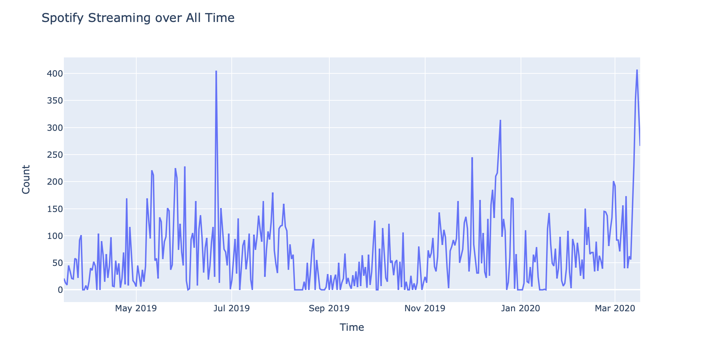
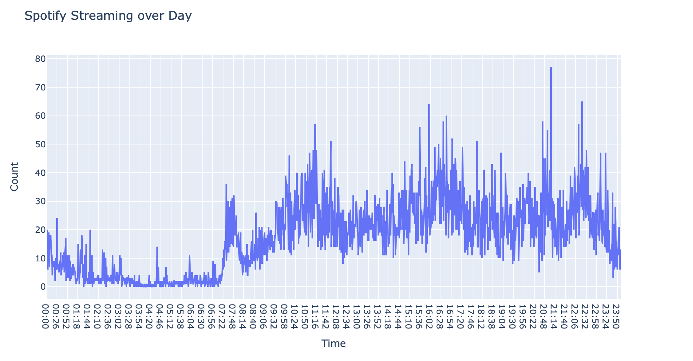
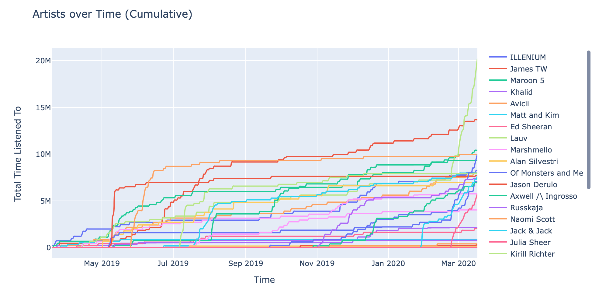
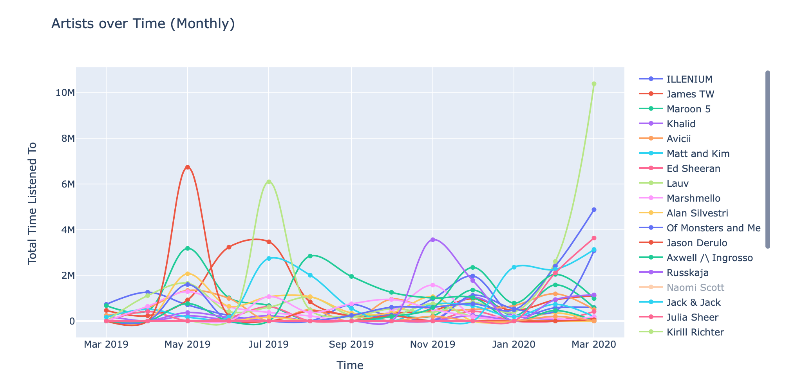
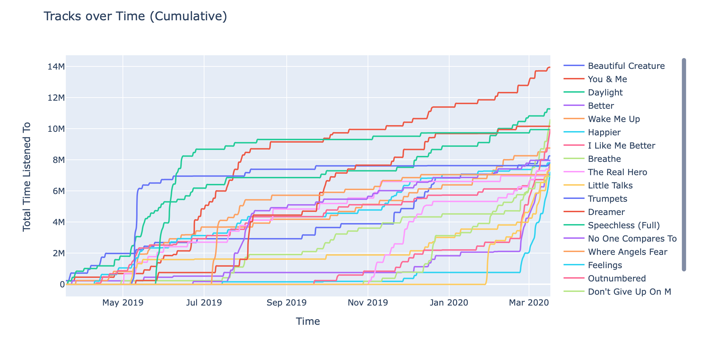
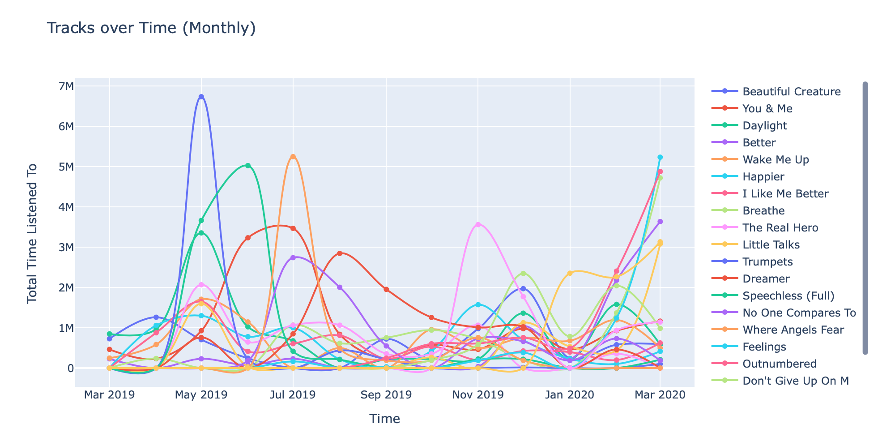
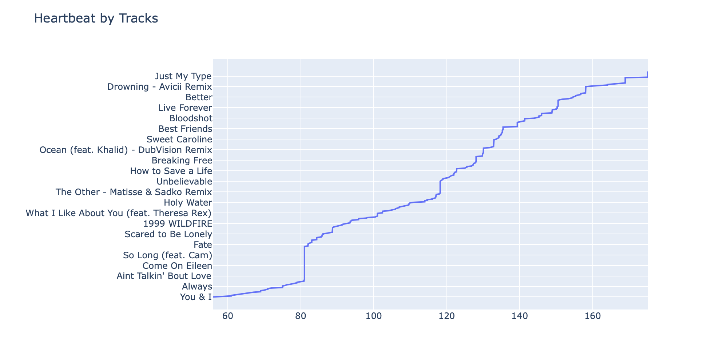

> This project is part of the Explore series: a mega-project that I've been working on for several months in which I analyze my day-to-day habits through data.

Every year, Spotify releases Spotify Wrapped. It's a combination of both one's personal streaming habits wrapped into a set of highly customized playlists, as well as playlists containing the past year's most popular hits across a variety of different genres. It's a feature completely driven by data collected by the Spotify platform – who's listening to what – and when – aggregated into a massive database of preferences used to curate the "perfect" playlist.

Thanks to GDPR and the California Consumer Privacy Act, we – as consumers – now have access to the data that Spotify collects on us. Earlier this month, I requested a copy of my data - and proceeded to run an analysis on when I listen to music, what I listen to, and how it fits in with the rest of my life.

I've released my code on [GitHub]( https://github.com/shomilj/Explore-Spotify) – so feel free to [request your own data](https://support.spotify.com/ca-en/article/data-rights-and-privacy-settings/) and plug it in! Below is a summary of some interesting visualizations from my analysis.

#### File Overview

Here's a summary of the interesting files from this dataset.

| data             | description                                                  |
| ---------------- | ------------------------------------------------------------ |
| Identity         | Not surprisingly, Spotify knows my home address. It's probably sourced from when I upgraded to Premium - and entered my billing address. |
| SearchQueries    | Spotify saves every single search query I've ever entered – as well as the time/platform of the query and what I clicked on after I hit search. |
| StreamingHistory | Every single song I've streamed over the past year, as well as the `endTime`, `artistName`, `trackName`, and `msPlayed`. |

 

#### Streaming History over the Past 12 Months

#### Aggregated Daily Streaming History

 

#### Most Popular Tracks and Artists

| Track Name                                                   | ms played |
| :----------------------------------------------------------- | --------: |
| You & Me                                                     |  13954157 |
| Daylight                                                     |  11280494 |
| Breathe                                                      |  10615771 |
| Dreamer&nbsp;&nbsp;&nbsp;&nbsp;&nbsp;&nbsp;&nbsp;&nbsp;&nbsp;&nbsp;&nbsp;&nbsp;&nbsp;&nbsp;&nbsp;&nbsp;&nbsp;&nbsp;&nbsp;&nbsp;&nbsp;&nbsp;&nbsp;&nbsp;&nbsp;&nbsp;&nbsp;&nbsp;&nbsp;&nbsp;&nbsp;&nbsp;&nbsp;&nbsp;&nbsp;&nbsp;&nbsp;&nbsp;&nbsp;&nbsp;&nbsp;&nbsp;&nbsp;&nbsp;&nbsp;&nbsp;&nbsp;&nbsp;&nbsp;&nbsp;&nbsp;&nbsp;&nbsp;&nbsp;&nbsp;&nbsp;&nbsp;&nbsp;&nbsp;&nbsp;&nbsp;&nbsp;&nbsp;&nbsp;&nbsp;&nbsp;&nbsp;&nbsp;&nbsp;&nbsp;&nbsp;&nbsp;&nbsp;&nbsp;&nbsp;&nbsp;&nbsp;&nbsp;&nbsp;&nbsp; |  10161831 |
| Outnumbered                                                  |   9988893 |
| Speechless (Full)                                            |   9951034 |
| Wake Me Up                                                   |   8766125 |
| Beautiful Creatures (feat. MAX)                              |   8254825 |

| ARTIST Name                                                  | ms played |
| :----------------------------------------------------------- | --------: |
| Lauv                                                         |  78715733 |
| Alan Silvestri                                               |  44219050 |
| Avicii&nbsp;&nbsp;&nbsp;&nbsp;&nbsp;&nbsp;&nbsp;&nbsp;&nbsp;&nbsp;&nbsp;&nbsp;&nbsp;&nbsp;&nbsp;&nbsp;&nbsp;&nbsp;&nbsp;&nbsp;&nbsp;&nbsp;&nbsp;&nbsp;&nbsp;&nbsp;&nbsp;&nbsp;&nbsp;&nbsp;&nbsp;&nbsp;&nbsp;&nbsp;&nbsp;&nbsp;&nbsp;&nbsp;&nbsp;&nbsp;&nbsp;&nbsp;&nbsp;&nbsp;&nbsp;&nbsp;&nbsp;&nbsp;&nbsp;&nbsp;&nbsp;&nbsp;&nbsp;&nbsp;&nbsp;&nbsp;&nbsp;&nbsp;&nbsp;&nbsp;&nbsp;&nbsp;&nbsp;&nbsp;&nbsp;&nbsp;&nbsp;&nbsp;&nbsp;&nbsp;&nbsp;&nbsp;&nbsp;&nbsp;&nbsp;&nbsp;&nbsp;&nbsp;&nbsp;&nbsp; |  41368114 |
| Coldplay                                                     |  38140870 |
| ILLENIUM                                                     |  36235610 |
| James TW                                                     |  35731886 |
| Hans Zimmer                                                  |  31516690 |
| Maroon 5                                                     |  31172415 |

 

#### Artists over Time – Cumulative & Monthly

#### Tracks Over Time – Cumulative & Monthly

#### Heartbeat Correlation

In this section, I explore the correlations between my Apple Watch-collected heartbeat data and my Spotify Streaming History. 

| track                                                        | average heartbeat |
| ------------------------------------------------------------ | ----------------: |
| Everywhere - 2017 Remaster                                   |            175.06 |
| SOS (feat. Aloe Blacc)                                       |            175.06 |
| Just My Type                                                 |            175.06 |
| ...&nbsp;&nbsp;&nbsp;&nbsp;&nbsp;&nbsp;&nbsp;&nbsp;&nbsp;&nbsp;&nbsp;&nbsp;&nbsp;&nbsp;&nbsp;&nbsp;&nbsp;&nbsp;&nbsp;&nbsp;&nbsp;&nbsp;&nbsp;&nbsp;&nbsp;&nbsp;&nbsp;&nbsp;&nbsp;&nbsp;&nbsp;&nbsp;&nbsp;&nbsp;&nbsp;&nbsp;&nbsp;&nbsp;&nbsp;&nbsp;&nbsp;&nbsp;&nbsp;&nbsp;&nbsp;&nbsp;&nbsp;&nbsp;&nbsp;&nbsp;&nbsp;&nbsp;&nbsp;&nbsp;&nbsp;&nbsp;&nbsp;&nbsp;&nbsp;&nbsp;&nbsp;&nbsp;&nbsp;&nbsp;&nbsp;&nbsp;&nbsp;&nbsp;&nbsp;&nbsp;&nbsp;&nbsp;&nbsp;&nbsp;&nbsp;&nbsp;&nbsp;&nbsp;&nbsp;&nbsp; |               ... |
| FRIENDS                                                      |                62 |
| Dance Monkey                                                 |                61 |
| All You Need To Know (feat. Calle Lehmann)                   |                61 |
| Guiding Light                                                |                61 |
|                                                              |                   |

| artist                                                       | average heartbeat |
| ------------------------------------------------------------ | ----------------: |
| BANNERS                                                      |            175.06 |
| TOTO                                                         |            175.06 |
| Lord Huron                                                   |            175.06 |
| ...&nbsp;&nbsp;&nbsp;&nbsp;&nbsp;&nbsp;&nbsp;&nbsp;&nbsp;&nbsp;&nbsp;&nbsp;&nbsp;&nbsp;&nbsp;&nbsp;&nbsp;&nbsp;&nbsp;&nbsp;&nbsp;&nbsp;&nbsp;&nbsp;&nbsp;&nbsp;&nbsp;&nbsp;&nbsp;&nbsp;&nbsp;&nbsp;&nbsp;&nbsp;&nbsp;&nbsp;&nbsp;&nbsp;&nbsp;&nbsp;&nbsp;&nbsp;&nbsp;&nbsp;&nbsp;&nbsp;&nbsp;&nbsp;&nbsp;&nbsp;&nbsp;&nbsp;&nbsp;&nbsp;&nbsp;&nbsp;&nbsp;&nbsp;&nbsp;&nbsp;&nbsp;&nbsp;&nbsp;&nbsp;&nbsp;&nbsp;&nbsp;&nbsp;&nbsp;&nbsp;&nbsp;&nbsp;&nbsp;&nbsp;&nbsp;&nbsp;&nbsp;&nbsp;&nbsp;&nbsp; |               ... |
| The Blue Notes                                               |                66 |
| Paul Cesar                                                   |                64 |
| Mumford & Sons                                               |                61 |
| Tones And I                                                  |                61 |
|                                                              |                   |

