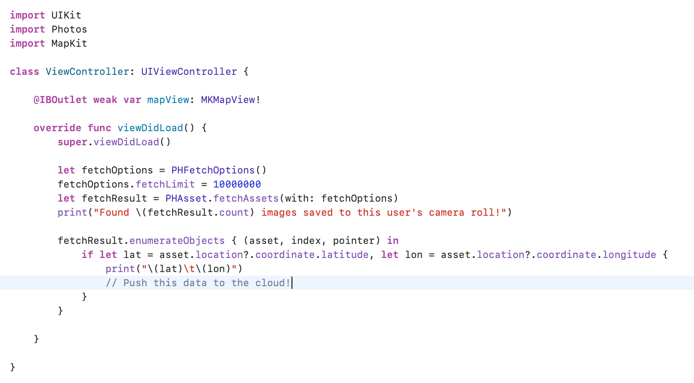

This week, inspired by a lecture by Professor David Wagner in [CS 161 (Computer Security)](http://cs161.org) course at UC Berkeley, I discovered a remarkable vulnerability in the design of the iOS API dealing with a user's on-device photo library. 

I was thinking about all of the different ways app developers can extract users'  location information: using analytics data containing IP Addresses and performing a lookup on a general region, recording in-app search results for destinations near a user's location, or just explicitly requesting permission for a user's location to enable an in-app feature. 

As it turns out, there's one more way that developers can access your location data – and it doesn't even require permissions specific to location at all. Take a look at the code below.

Every single photo that a user takes on an iPhone has metadata associated with it – in particular, a hyper-precise latitude and longitude.  Using just an instance of the Photo Fetching API through the native Photos library on iOS – `PHFetchOptions()` and `PHAsset.fetchAssets(...)` – it's possible to iterate through every photo ever taken on a user's device and extract geographical information to build a historical map of everywhere a user's been.

Photo-based location extraction is, perhaps, even more accurate than some of the methods mentioned above. Here are a few reasons why:

- It provides historical data – on my device, I found 10K photos taken over the last five years – whereas other methods only provide location information from the time a user installs an app. 
- Users don't have to have the app open to have a reliable stream of information; photos can be taken arbitrarily (as one normally would) and the malicious app would have access to all photo metadata on next launch.
- Users don't have to grant permission for location access! Any app that requests for photo access immediately has access to this trove of location data. Apps across all categories request access to users' photo libraries, whether to upload profile pictures or to share content via in-app chat.
- Photo-based location may be more useful for extracting user patterns than other data. For example, an advertiser could correlate home and work locations based on time-of-day and photo quantity (assuming that over time, users take many photos around the house and perhaps a few photos at work). Advertisers could also extract stores where photos have been taken by using a reverse address lookup tool, which would serve as high quality advertising data.

After doing some brief reseach on the vulnerability, it seems that it's been around since [2017](https://openradar.appspot.com/34610699), and Apple hasn't done anything to fix it. Thus, any app that's requesting full access to users' photo library could potentially be scraping location data & selling that information to third parties.

It's important to note that this doesn't apply to instances where developers choose to use the built-in `UIImagePickerController` - a pop-up screen managed by native iOS interfacing with apps that prompt users to select individual or multiple images. However, many apps – Facebook Messenger, Instagram, and others – choose to implement their own custom image pickers, at which point they have access to the photo metadata described above.