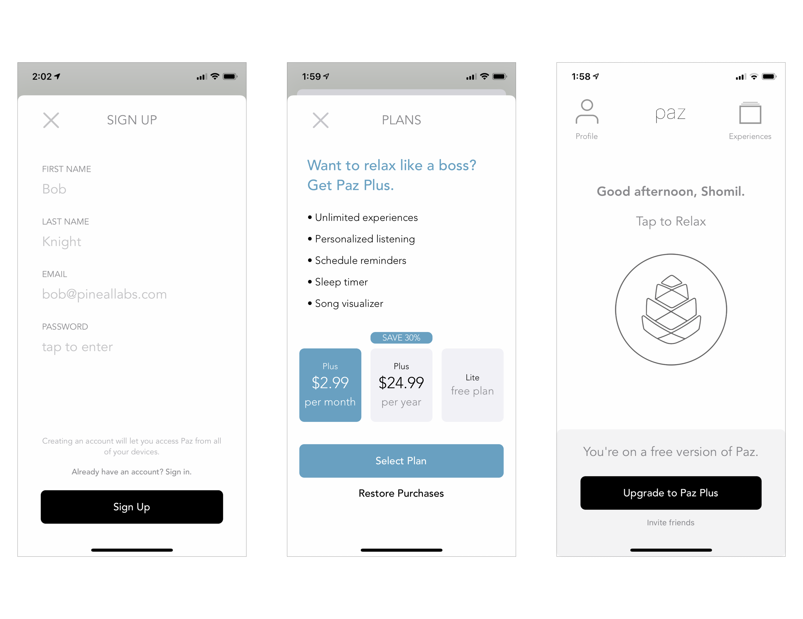
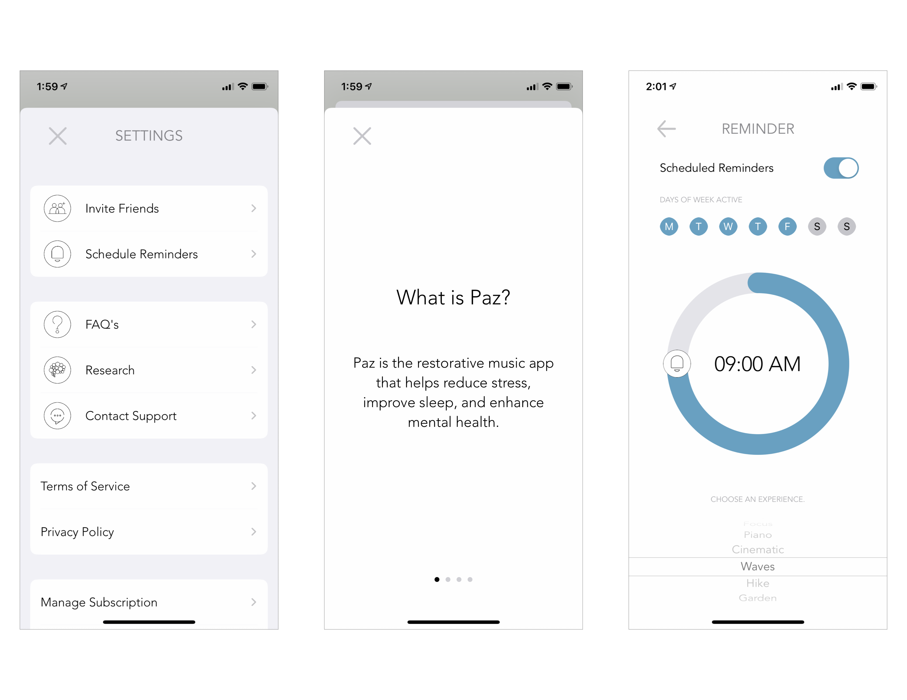
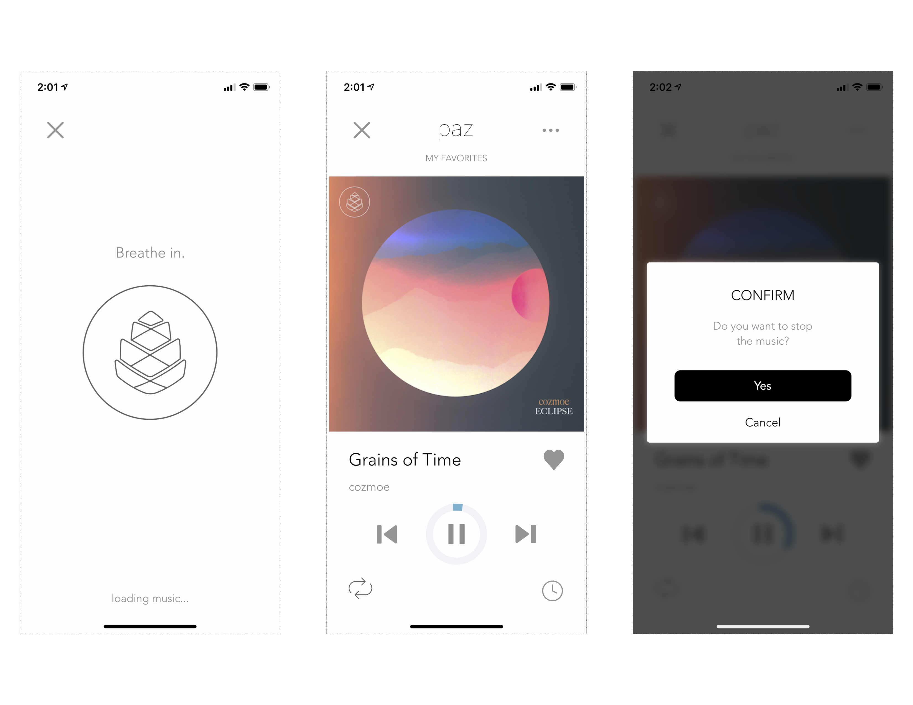
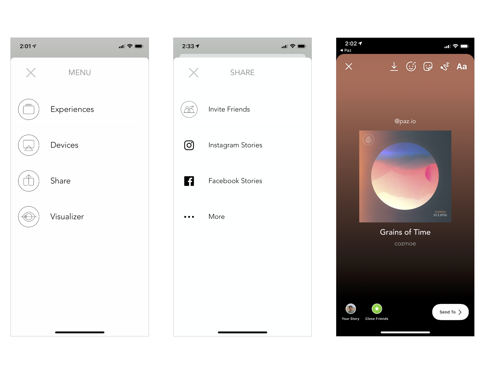

Over the past few months, I've been working part-time at a small UC Berkeley startup: [Pineal Labs](http://pineallabs.com). I met the founders – a music executive-turned-record producer and an investment banker completing an MBA at Haas – on Sproul Plaza in early February, when they came up to my student organization's table and introduced themselves.

Their vision was simple: what if you could achieve the same mental and psychological benefits of meditation by simply listening to carefully-crafted sounds? They believed that it was possible – and had the [research](https://www.paz.io/research) to back it up.

What originally started as a hacked-together, rapidly-built MVP turned into a fully-functional streaming app, one that I had the opportunity to design and architect from the ground up. Over the past few months, I've worked closely with the founders, transforming their vision into the completed product below.

<video muted controls width="40%" style="display:block; margin:0 auto; border-style: dotted; border-width: 1px; border-color: #ebeff0">
    <source src="screen_recording.mov" type="video/mp4">
</video>

 

Read more about Paz in the [Haas Newsroom](https://newsroom.haas.berkeley.edu/startup-roundup-paz-and-thrive-education/) article.

Download Paz today on the [iOS App Store](https://apps.apple.com/us/app/paz-relax-sleep-meditate/id1500085577).

> This project was built on Firebase, Google Cloud Functions, and Airtable (as a CMS) primarily using Swift and Python.

