The [Neo4J Graph Platform](http://neo4j.com) is an incredibly powerful graph visualization tool for social networks. Below, I walk through the process of scraping and visualizing my Spotify Network: artists, tracks, and playlists scraped from my personal profile and my friends' public profiles.

### Scraping Spotify Data

To extract data from my friends' public playlists on Spotify, I used the network inspector from Chrome Developer Tools to identify Spotify's Backend API. Then, I copied the HTTPS GET Request headers and used [Trillworks](https://curl.trillworks.com/) to convert the CURL request into Python Requests syntax.

I then wrote some wrapper methods around each API endpoint to facilitate my queries for playlists & tracks associated with those playlists.

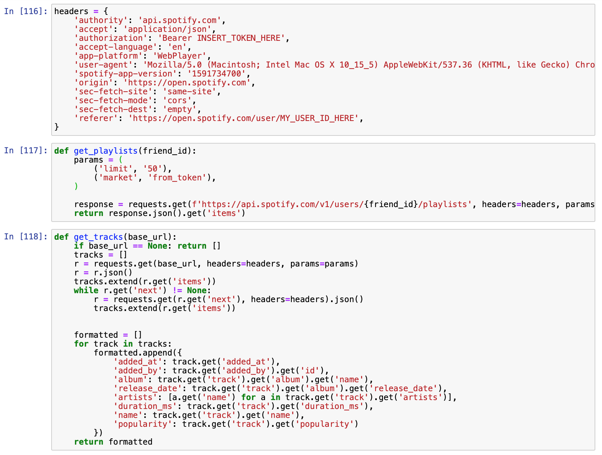

### Designing the Neo4J Graph Data Structure

Neo4J uses the Cypher graph programming language to interface with the graph database. Below are examples of creating nodes & edges.

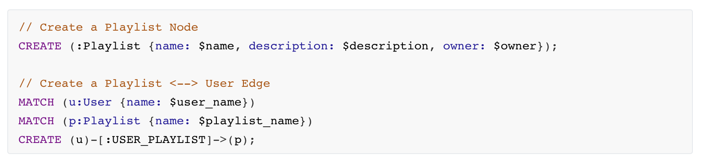

After creating & inserting all nodes & edges, my graph data structure had the following schema.

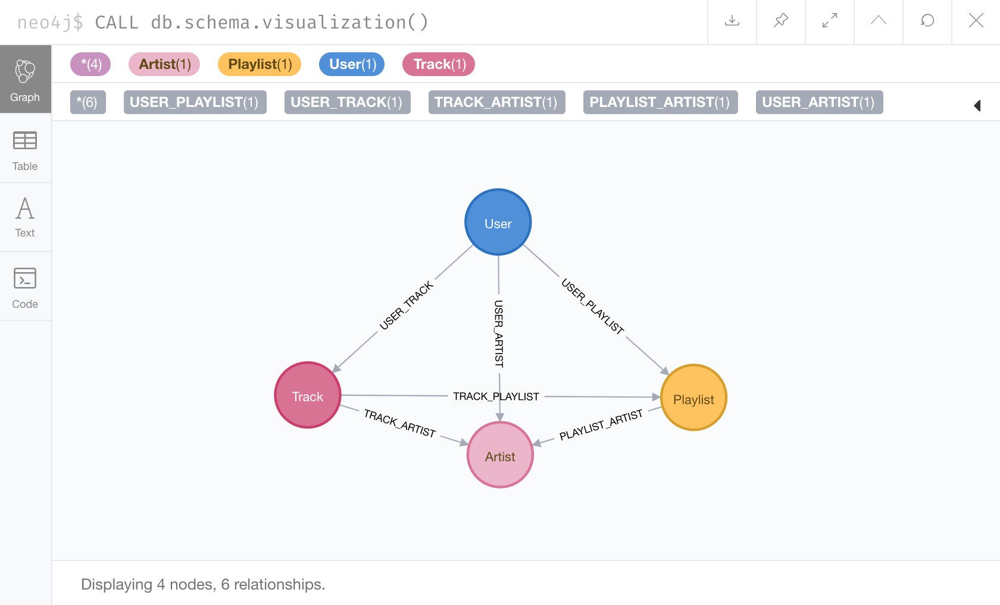

# Visualizing the Graph

With data from just four users, my graph database had nearly 5,000 nodes and 17,000 edges. Here are some screenshots of different visualizations. **Note that these graphs include data scraped from the public profiles of only four users, one of which is myself!**

##### User // Track Edges

While there's a small section of overlap (the concentrated area in the intersection of all three clusters), most of the tracks in users' public playlists are unique to those users. It's interesting to note that two users (see the two yellow nodes near the upper left cluster) are extremely close together, indicating similar music taste relative to the other two users.

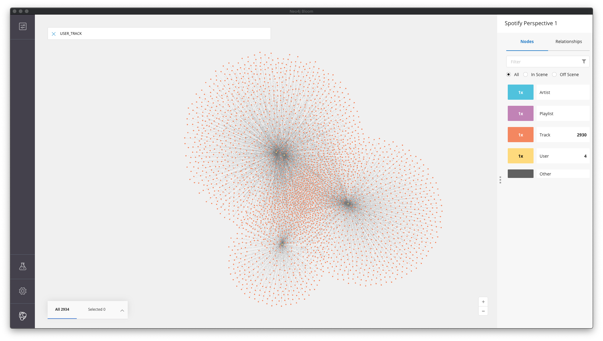

##### User // Track + Track // Playlist Edges

When the Track/Playlist edges are added to the network, it appears that the density of "popular" tracks increase – tracks that show up in multiple playlists AND are connected by multiple users are clustered closer together than those that show up in fewer playlists and/or are liked by only one or two users.

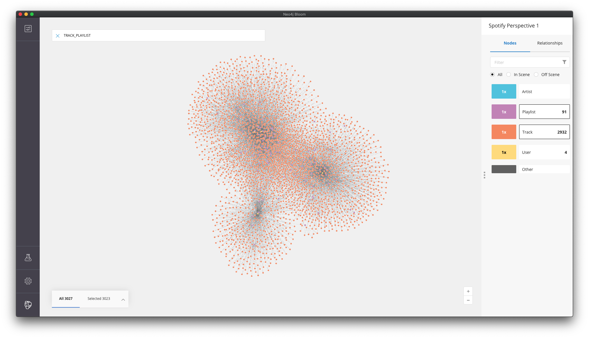

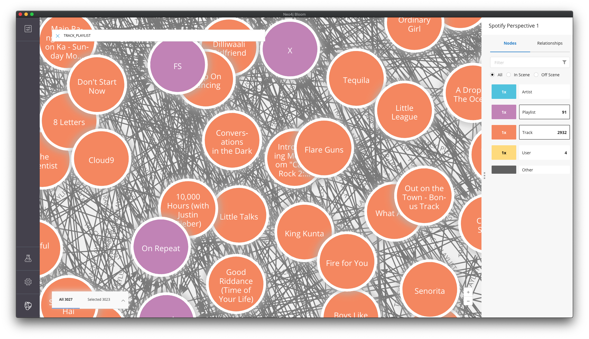

##### User // Artist Edge

In this case, three users are incredibly close together, whereas one user is further away. It's interesting to note that this relationship creates a different natural cluster than the User // Track relationship – likely because artist is a closer indicator of similar taste than matching particular tracks.

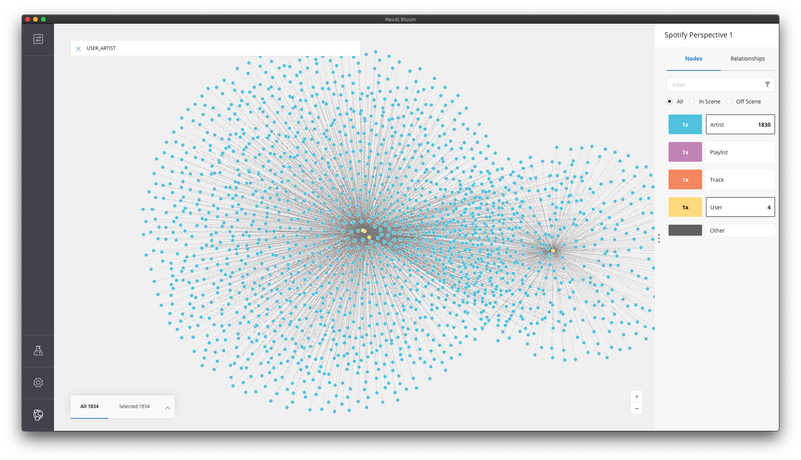

##### Track // Artist Edge

When we add just the Track/Artist edges, notice the hundreds of isolated sub-graphs of single or few artists that break off from our main graph – artists that never (or rarely) collaborated with other artists. Examples of these types of artists include James TW, Gavin DeGraw, The Lumineers, and Roo Panes. 

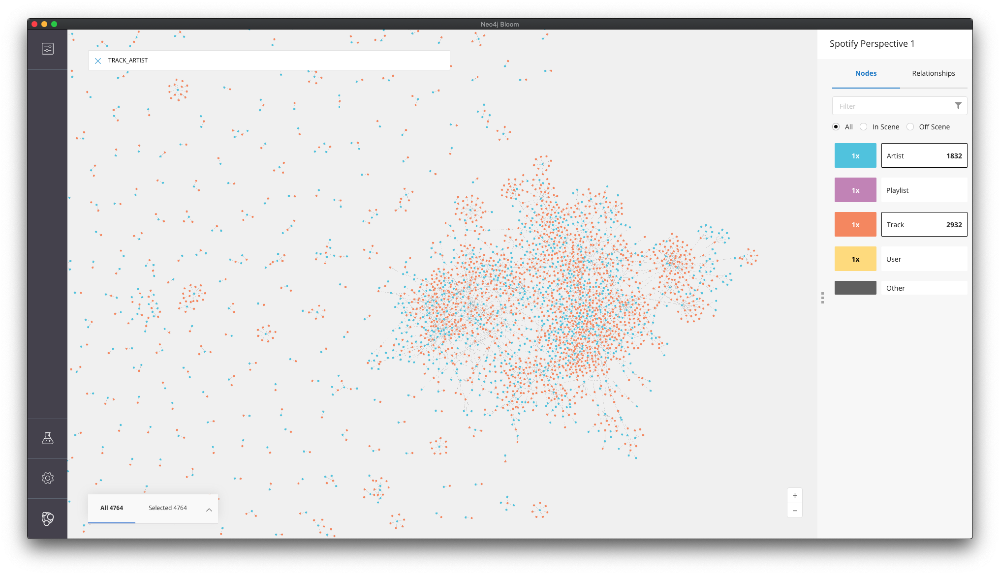

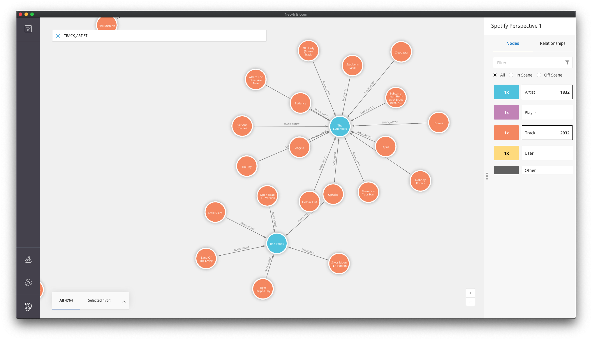

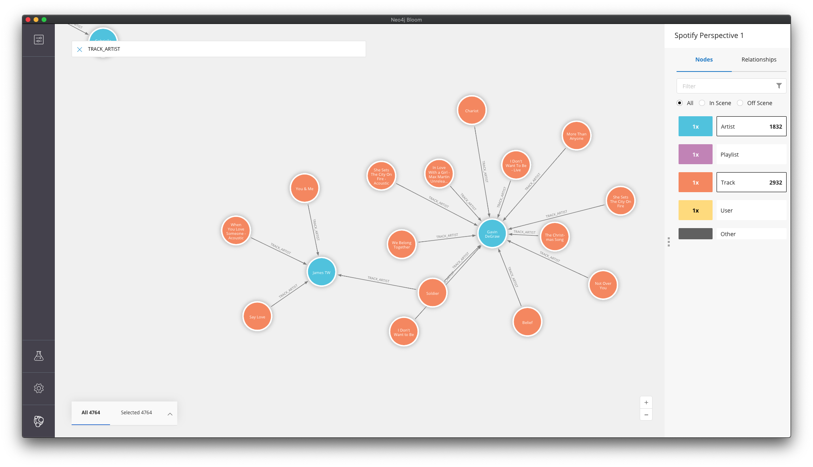

More mainstream pop artists – Rihanna, Eminem, etc. – collaborate with other artists more frequently and, thus, are in the more dense/concentrated areas of the network. 

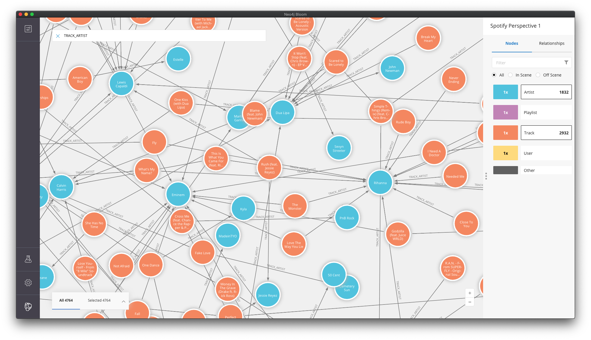

